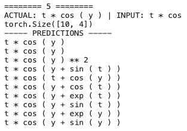

# Observations

This file has the details on Experiments. All the tensorboard summaries are stores in `models/` folder to get all the observations run the following command
```
tensorboard --logdir=models/
```
and you will get all the obeservations.

## Data

I created datasets of various sizes, following describes them

| name   | use_samples | Nmin | Nmax | p1min | p1max | p2min | p2max | lmin | lmask | maxlen | num_samples |
|--------|-------------|------|------|-------|-------|-------|-------|------|-------|--------|-------------|
| small  | 12999       | 5    | 1    | 1     | 3     | 1     |  3    | 1    | 3     | 20     | 40          |
| medium | NA          | 1    | 6    | 1     | 6     | 1     | 6     | 1    | 6     | 40     | 100         |

To rebuild, pass values to `data_config` object in `prepare_data.py`.

**NOTE:** when making the final dataset, I use the following logic:
```
input_variables: in range (-1, 1)
all samples where !(10 > "o" > -10) --> thrown away
```

I believe this might cause issues if the values are always less then unity. Will create another dataset where `input_variables` will be in range (-3, 3).


## Plato ("Small")

Small networks with 13000 samples dataset, `test_train_split = -0.9`, `use_vars_masking` tells to mask vairables at the beginning

| model_name | dataset | n_samples | epochs | batch_size | warmup_steps | lr_mult | encoder_maxlen | decoder_maxlen | use_var_masking | n_embd | n_layer | n_head |
|------------|---------|-----------|--------|------------|--------------|---------|----------------|----------------|-----------------|--------|---------|--------|
| plato       | small   | 12999     | 20     | 128        | 300          | 1       | 40             | 20             | True           | 128    | 6       | 8      |
| plato2      | small   | 12999     | 20     | 128        | 50           | 0.1     | 40             | 20             | True           | 128    | 6       | 8      |
| plato3      | small   | 12999     | 20     | 128        | 50           | 0.1     | 40             | 20             | True           | 128    | 6       | 8      |
| ✅ plato4   | small   | 12999     | 20     | 128        | 50           | 0.1     | 40             | 20             | False            | 128    | 6       | 8      |
| plato5      | small   | 12999     | 20     | 128        | 50           | 0.1     | 40             | 20             | False            | 128    | 6       | 2      |
| plato6      | small   | 12999     | 20     | 512        | 23 (1 batch) | 0.1     | 40             | 20             | False            | 128    | 6       | 2      |
| plato7      | small   | 12999     | 20     | 512        | 46 (2 batch) | 0.1     | 40             | 20             | False            | 128    | 6       | 2      |
| plato8      | small   | 12999     | 20     | 64         | 100          | 0.1     | 40             | 20             | False            | 128    | 6       | 2      |
| plato9      | small   | 12999     | 20     | 128        | 50           | 0.1     | 40             | 20             | False            | 128    | 6       | 4      |
| plato_med_1 | medium  | 14209     | 20     | 128        | 60           | 0.1     | 100            | 40             | False            | 128    | 6       | 8      |

Couple of observations from `plato_small` test:

1. There is no significant advantage to having more heads
2. Model learns better if it is given all the input rather than masking the embedding of variable that is not in the equation
3. When in use model performs significantly better when given the first few tokens as input (this is cherry picked)



4. Model has hard time learning about numbers eg. `1.234 + sin(x)`
5. All this points to a simple thing that it needs to be trained on more data
6. Larger batch size does not have a big effect either 128 works better than 512
7. Model `plato4` had the best configuration, training time etc. for the given data


### Machine Intelligence

Over time as I have started plotting what are the plots of predictions made by the model, of those that have less L1 and L2 (MSE) score. There are some interesting matches that shows the machine is creative and is learning:
```
========================================
ACTUAL: - exp ( y ) / 7 | INPUT: - exp (
torch.Size([10, 4])
----- PREDICTIONS -----
- exp ( y ) * tan ( y ) --> (L1: 30.7936703671725, L2: 8.728696595361448)
- exp ( y ) / ( tan ( y ) ) --> (L1: 129.040236261243, L2: 27.916745530179345)
- exp ( y ) / ( tan ( y ) ) --> (L1: 129.040236261243, L2: 27.916745530179345)
- exp ( y ) / ( tan ( y ) - 2 ) --> (L1: 49.3757639109798, L2: 10.551811756552183)
- exp ( y ) / ( tan ( y ) - 1 ) --> (L1: 185.140310364239, L2: 61.60294514099505)
- exp ( y ) / ( tan ( y ) - 4 ) --> (L1: 21.7903630765197, L2: 3.167270240231462)
- exp ( y ) / ( tan ( y ) - 3 ) --> (L1: 28.4125058186276, L2: 4.593653572843078)
- exp ( y ) / ( tan ( y ) - 3 ) --> (L1: 28.4125058186276, L2: 4.593653572843078)
- exp ( y ) / ( tan ( y ) + 8 ) --> (L1: 1.21676813345117, L2: 1.6418358502702133)
- exp ( y ) / ( tan ( y ) + 5 ) --> (L1: 2.14199441108556, L2: 2.034006150014397)
```

Notice that the second last prediction (`- exp ( y ) / ( tan ( y ) + 5 )`) is actually the closest match to the actual data. When I plot the graph I got the image below:


In the first plot see that the two graphs are pretty same, red arrow points to the predicttion and green to the actual curve. Thus though it is learning in values smaller than 1 have weird behaviour, we need to include bigger numbers as well.