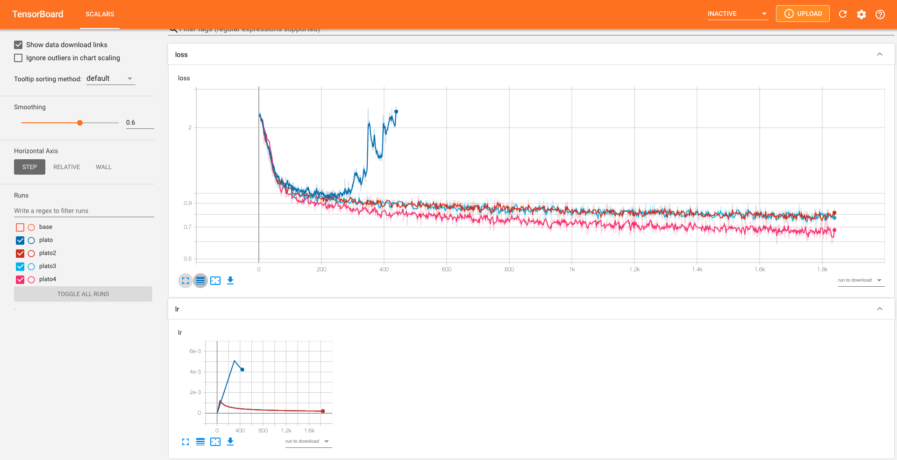

# Observations

This file has the details on Experiments. All the tensorboard summaries are stores in `models/` folder to get all the observations run the following command
```
tensorboard --logdir=models/
```
and you will get all the obeservations.

## Data

I created datasets of various sizes, following describes them

| name   | use_samples | Nmin | Nmax | p1min | p1max | p2min | p2max | lmin | lmask | maxlen | num_samples |
|--------|-------------|------|------|-------|-------|-------|-------|------|-------|--------|-------------|
| small  | 12999       | 5    | 1    | 1     | 3     | 1     |  3    | 1    | 3     | 20     | 40          |
| medium | NA          | 1    | 6    | 1     | 6     | 1     | 6     | 1    | 6     | 40     | 100         |

To rebuild, pass values to `data_config` object in `prepare_data.py`.

**NOTE:** when making the final dataset, I use the following logic:
```
input_variables: in range (-1, 1)
all samples where !(10 > "o" > -10) --> thrown away
```

I believe this might cause issues if the values are always less then unity. Will create another dataset where `input_variables` will be in range (-3, 3).


## Plato ("Small")

Small networks with 13000 samples dataset, `test_train_split = -0.9`, `use_vars_masking` tells to mask vairables at the beginning

| model_name | dataset | n_samples | epochs | batch_size | warmup_steps | lr_mult | encoder_maxlen | decoder_maxlen | use_var_masking | n_embd | n_layer | n_head |
|------------|---------|-----------|--------|------------|--------------|---------|----------------|----------------|-----------------|--------|---------|--------|
| plato      | small   | 12999     | 20     | 128        | 300          | 1       | 40             | 20             | True           | 128    | 6       | 8      |
| plato2     | small   | 12999     | 20     | 128        | 50           | 0.1     | 40             | 20             | True           | 128    | 6       | 8      |
| plato3     | small   | 12999     | 20     | 128        | 50           | 0.1     | 40             | 20             | True           | 128    | 6       | 8      |
| plato4     | small   | 12999     | 20     | 128        | 50           | 0.1     | 40             | 20             | False            | 128    | 6       | 8      |
| plato5     | small   | 12999     | 20     | 128        | 50           | 0.1     | 40             | 20             | False            | 128    | 6       | 2      |

Following is the screenshot of the tensorboard:



Couple of observations from plato test:

1. There is no significant advantage to having more heads
2. Model learns better if it is given all the input rather than masking the embedding of variable that is not in the equation
3. When in use model performs significantly better when given the first few tokens as input (this is cherry picked)


4. Model has hard time learning about numbers eg. `1.234 + sin(x)`
5. All this points to a simple thing that it needs to be trained on more data
