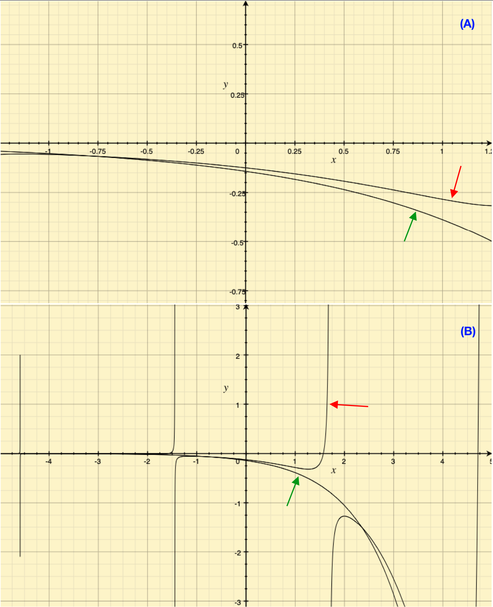

# Observations

This file has the details on Experiments. All the tensorboard summaries are stores in `models/` folder to get all the observations run the following command
```
tensorboard --logdir=models/
```
and you will get all the observations.

## Experiment

It is possible to train an encoder-decoder transformer based neural network to predict symbolic mathematical expression by directly showing the observed data. One sample is given below:
```
---- OBSERVATION ----
( 0.252,  -1.17,  -1.32  )  --> (6.86)
( -1.32,  -0.943, -1.94  )  --> (6.84)
( 1.74,   -0.823, -0.337 )  --> (4.87)
( -0.371, -1.13,  1.72   )  --> (3.79)
( -1.46,  -1.51,  -0.433 )  --> (4.99)
( -0.686, -0.494, -2.0   )  --> (7.59)
( 1.72,   1.54,   -0.366 )  --> (5.78)
( 0.878,  -1.87,  -1.45  )  --> (6.39)
( -0.594, -0.208, 1.05   )  --> (4.7 )
( -1.35,  -0.462, 1.26   )  --> (3.79)
*90 more samples
---- EXPRESSION ----
- t + 0 . 3 6 8 * y + cos ( x ) + 5
```

## Data

I created datasets of various sizes, following describes them

| name    | use_samples | Nmin | Nmax | p1min | p1max | p2min | p2max | lmin | lmask | maxlen | num_samples | obs_range | inp_range |
|---------|-------------|------|------|-------|-------|-------|-------|------|-------|--------|-------------|-----------|-----------|
| small   | 12999       | 5    | 1    | 1     | 3     | 1     |  3    | 1    | 3     | 20     | 40          | (-50,50)  | (-1, 1)   |
| medium  | 14209       | 1    | 6    | 1     | 6     | 1     | 6     | 1    | 6     | 40     | 100         | (-10,10)  | (-1, 1)   |
|medium46k| 46101       | 1    | 6    | 1     | 6     | 1     | 6     | 1    | 6     | 40     | 100         | (-10,10)  | (-2, 2)   |

To rebuild, pass values to `data_config` object in `prepare_data.py`.

To generate observations from the expressions, random values between `inp_range` are fed and if the observation values are not in `obs_range`, we discard them.

## Plato

Small networks with 13000 samples dataset, `test_train_split = -0.9`, `use_vars_masking` tells to mask vairables at the beginning

| model_name | dataset | n_samples | epochs | batch_size | warmup_steps | lr_mult | encoder_maxlen | decoder_maxlen | use_var_masking | n_embd | n_layer | n_head | openai_block | use_emb_weights |
|------------|---------|-----------|--------|------------|--------------|---------|----------------|----------------|-----------------|--------|---------|--------|--------|--------|
| plato       | small   | 12999     | 20     | 128        | 300          | 1       | 40             | 20             | True           | 128    | 6       | 8      | False | False |
| plato2      | small   | 12999     | 20     | 128        | 50           | 0.1     | 40             | 20             | True           | 128    | 6       | 8      | False | False |
| plato3      | small   | 12999     | 20     | 128        | 50           | 0.1     | 40             | 20             | True           | 128    | 6       | 8      | False | False |
| ✅ plato4   | small   | 12999     | 20     | 128        | 50           | 0.1     | 40             | 20             | False            | 128    | 6       | 8      | False | False |
| plato5      | small   | 12999     | 20     | 128        | 50           | 0.1     | 40             | 20             | False            | 128    | 6       | 2      | False | False |
| plato6      | small   | 12999     | 20     | 512        | 23 (1 batch) | 0.1     | 40             | 20             | False            | 128    | 6       | 2      | False | False |
| plato7      | small   | 12999     | 20     | 512        | 46 (2 batch) | 0.1     | 40             | 20             | False            | 128    | 6       | 2      | False | False |
| plato8      | small   | 12999     | 20     | 64         | 100          | 0.1     | 40             | 20             | False            | 128    | 6       | 2      | False | False |
| plato9      | small   | 12999     | 20     | 128        | 50           | 0.1     | 40             | 20             | False            | 128    | 6       | 4      | False | False |
| plato_med_1 | medium  | 14209     | 20     | 128        | 60           | 0.1     | 100            | 40             | False            | 128    | 6       | 8      | False | False |
| plato46k    |medium46k| 46101     | 20     | 128        | 300          | 0.1     | 100            | 40             | False            | 128    | 6       | 8      | False | False |
| plato46k2   |medium46k2| 46101     | 20     | 128        | 300          | 0.1     | 100            | 40             | False           | 128    | 6       | 8      | True  | False |
| plato46k3   |medium46k2| 46101     | 20     | 128        | 300          | 0.1     | 100            | 40             | False           | 128    | 6       | 8      | True  | True  |

Couple of observations from `plato_small` test:

1. There is no significant advantage to having more heads
2. Model learns better if it is given all the input rather than masking the embedding of variable that is not in the equation
3. When in use model performs significantly better when given the first few tokens as input (this is cherry picked)

```
========================================
ACTUAL: t * cos ( y ) | INPUT: t * 
----- PREDICTIONS -----
t * cos ( y )
t * cos ( y )
t * cos ( y ) * 0 . 8 9 2
t * cos ( y ) ** 2
t * ( y + sin ( y ) )
t * ( y + cos ( y ) + sin ( y ) )
t * ( y + cos ( y ) )
```

4. Model has hard time learning about numbers eg. `1.234 + sin(x)`
5. All this points to a simple thing that it needs to be trained on more data
6. Larger batch size does not have a big effect either 128 works better than 512
7. Model `plato4` had the best configuration, training time etc. for the given data
8. Despite bad results model has learned however which variables are occuring in the data, thus suggesting that has understood something.


Couple of observations from `plato_med` test:
1. There is no significant advantage to having a larger training dataset as the generated output is still pretty bad.
2. There is no improvement in generated result with handholding (giving first few words of the expression) as you can see below:
```
========================================
ACTUAL: t * x / sin ( z ) | INPUT: None
----- PREDICTIONS -----
t * z + exp ( x ) / t --> (L1: 1092.57729142708, L2: 653.8561465013971)
t * z + exp ( x ) / t + z --> (L1: 1101.60681513829, L2: 653.3741596357142)
t * ( x + z ) * exp ( z ) / t --> (L1: 330.623816311142, L2: 53.677098955808695)
t * ( x + z ) * exp ( z ) / t --> (L1: 330.623816311142, L2: 53.677098955808695)
t * ( x + z + exp ( z ) ) / tan ( t ) --> (L1: 253.435837847999, L2: 35.2377222913459)
t * ( x + z + exp ( x ) ) / cos ( z ) --> (L1: 1882.21840715213, L2: 1143.6356411298998)
t * ( x + z + exp ( t ) ) / tan ( z ) --> (L1: 499.739623317700, L2: 240.26708674166844)
t * ( x + z + exp ( x ) ) / sin ( z ) --> (L1: 399.400283393530, L2: 110.60275682741171)
t * ( x + z + exp ( x ) ) / cos ( t ) --> (L1: 9293.51747569875, L2: 5333.149490138249)
t * ( x + z + exp ( x ) ) / sin ( t ) --> (L1: 370.650702507697, L2: 56.46316740521104)

========================================
ACTUAL: exp ( - x - y ) * sin ( z ) | INPUT: exp ( - x
torch.Size([10, 5])
----- PREDICTIONS -----
exp ( - x + y + z ) / z --> (L1: 828.961325158068, L2: 215.7260298983936)
exp ( - x + z ) / ( y + z ) --> (L1: 997.329812777314, L2: 395.1796703452368)
exp ( - x + z ) / ( y + z ) --> (L1: 997.329812777314, L2: 395.1796703452368)
exp ( - x + z ) / ( y + z ) --> (L1: 997.329812777314, L2: 395.1796703452368)
exp ( - x + z ) / ( y * z ) --> (L1: 4173.00231308175, L2: 3000.446020706761)
exp ( - x + z ) / ( y * z ) --> (L1: 4173.00231308175, L2: 3000.446020706761)
exp ( - x + z ) / ( y + z ) / z --> (L1: 1383.63487097177, L2: 423.14626284749045)
exp ( - x + z ) / ( y + z ) / y --> (L1: 4553.61375718010, L2: 3025.9457424497987)
exp ( - x + z ) / ( y + z ) / y --> (L1: 4553.61375718010, L2: 3025.9457424497987)
exp ( - x + z ) / ( y + z ) / y + z --> (L1: 4540.86342399648, L2: 3024.7119807144877)
```


### Machine Intelligence

Over time as I have started plotting what are the plots of predictions made by the model, of those that have less L1 and L2 (MSE) score. There are some interesting matches that shows the machine is creative and is learning:
```
========================================
ACTUAL: - exp ( y ) / 7 | INPUT: - exp (
torch.Size([10, 4])
----- PREDICTIONS -----
- exp ( y ) * tan ( y ) --> (L1: 30.7936703671725, L2: 8.728696595361448)
- exp ( y ) / ( tan ( y ) ) --> (L1: 129.040236261243, L2: 27.916745530179345)
- exp ( y ) / ( tan ( y ) ) --> (L1: 129.040236261243, L2: 27.916745530179345)
- exp ( y ) / ( tan ( y ) - 2 ) --> (L1: 49.3757639109798, L2: 10.551811756552183)
- exp ( y ) / ( tan ( y ) - 1 ) --> (L1: 185.140310364239, L2: 61.60294514099505)
- exp ( y ) / ( tan ( y ) - 4 ) --> (L1: 21.7903630765197, L2: 3.167270240231462)
- exp ( y ) / ( tan ( y ) - 3 ) --> (L1: 28.4125058186276, L2: 4.593653572843078)
- exp ( y ) / ( tan ( y ) - 3 ) --> (L1: 28.4125058186276, L2: 4.593653572843078)
- exp ( y ) / ( tan ( y ) + 8 ) --> (L1: 1.21676813345117, L2: 1.6418358502702133)
- exp ( y ) / ( tan ( y ) + 5 ) --> (L1: 2.14199441108556, L2: 2.034006150014397)
```

Notice that the second last prediction (`- exp ( y ) / ( tan ( y ) + 8 )`) is actually the closest match to the actual data. When I plot the graph I got the image below:



(A) represents the zoomed in version and (B) is the zoomed out versions. In (A) see that the two graphs are pretty same, red arrow points to the prediction and green to the actual curve. Whereas when zooming out (B), we see that the curves are actually very different. Thus though it is learning in values smaller than 1 have weird behaviour, we need to include bigger numbers as well.

## Remarks

By looking at the observations above it is hard to believe that the model is actually learning something from the data.
