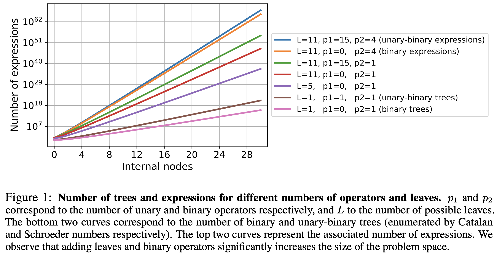

# Making Equations

[Deep Learning for Symbolic Mathematics](http://arxiv.org/abs/1912.01412)
    
Below is my understanding from the above mentioned paper on the generating
random expressions with $n$ internal nodes. Authors mention that they start
by generating random trees and selecting randomly their nodes and leaves.
This is discussed in Appendix C. from the paper and I have changed the
order for simpler explaination.

-------------------------------------------------
## Problem

To create training data of mathematical expressions, with $n$ internal nodes.
Expressions are created from a finite set of variables (ie. literals),
constants, integers and a list of operators that can be simple functions
(eg. `cos` of `exp`) or more involved operators (eg. integrals and
differetials). **Note that I do not consider involved operators and my
set of operators (both unary and binary) is much smaller**.

More precisely following is the problem space:
* trees with upto $n$ internal nodes
* Unary ($p_1$) - those operators that take only one argument, these will have
                  only one child eg. $\cos,\sin,\log,\exp$, etc.
* Binary ($p_2$) - those operators that take more than one child,
                   eg. $+,\times,-$, etc.
* A set of $L$ leaf values containing variables (eg. $x,y,z$), constants
  (eg. $e,\pi$), integers (eg. $\{-10, ..., 10\}$)

If $p_1 = 0$ expressions are represented by binary trees and if $p_1 > 0$,
expressions are unary-binary trees.

-------------------------------------------------
## Theory

* $e$: number of empty nodes
* $n$: number of operators yet to be generated
* $D(e,n)$: number of diferrent binary
* $K(e,n)$: probability distribution of the position (0-indexed) of the next
            internal node to allocate

From the paper we have the counts for total expressions in different
configurations of number of leaves, unary and binary operator counts



### Binary Trees

$D(e,n)$ subtrees that can be generated from $e$ empty elements, with $n$
internal nodes to generate. We have

* $D(0,n) = 0$: (no possible tree for 0 empty nodes and $n$ operators)
* $D(e,0) = 1$: (1 possible tree for $e$ empty nodes and 0 operators)
  from this we get that when we do not have any operators, all empty nodes
  must be leaves and so only one tree is possible
* $D(e,n) = D(e-1, n) + D(e+1, n-1)$:
  if e > 0 and first one is a
    - **leaf**: then there are $D(e-1,n)$ possible trees (1)
    - **node**: $D(e+1, n-1)$ possible trees             (2)

This allows us to compute $D(e,n)$ for all e and n. To calculate $K(e,n)$,
observe that among the $D(e,n)$ trees with e empty nodes and n operators,
$D(e + 1, n - 1)$ (1) have a binary node in their first position. Therefore,

* $P(K(e,n) = 0) = D(e+1,n-1) / D(e,n)$

for the remaining $D(e-1,n)$ (2) trees, $D(e,n-1)$ have a binary node in their
first position (same argument for $e-1$), that is

* $P(K(e,n) = 1) = D(e,n-1) / D(e,n)$

by induction over $k$, we have the general formula

* $P(K(e,n) = k) = D(e-k+1,n-1) / D(e,n)$

here $k$ in $\{0, ... ,e-1\}$.

```
start with an empty node
e = 1
while n > 0:
    sample a position 'k' from K(e, n)
    sample the 'k' next empty nodes as leaves
    sample an operator, create two empty children
    e = e - k + 1
    n = n - 1
```

### Unary-Binary

We adapt the previous algorithm by considering the two-dimensional
probability distribution $L(e,n)$ of position (0-indexed) and arity of
the next internal node (ie. $P(L(e,n) = (k,a))$ is the porbability
that the next internal node is in the position $k$ and has arity $a$)

To compute L(e,n), we derive D(e,n), the number of subtrees with n
internal nodes can be generated from e empty nodes. We have for all
n > 0 and e:

* $D(0,n) = 0$
* $D(e,0) = 1$
* $D(e,n) = D(e-1,n) + D(e,n-1) + D(e+1,n-1)$

The third eqaution states that with $n > 0$ nodes, the first one will
either be a leaf ($D(e-1,n)$ possible trees), a unary operator
($D(e,n-1)$ possible trees) or a binary operator ($D(e+1,n-1)$ trees).

To derive $L(e,n)$, we observe that $D(e,n-1)$ have unary operator at
node/position 0, thus we get ($n=1$ for unary)

* $P(L(e,n) = (0,1)) = D(e,n-1) / D(e,n)$

and $D(e+1,n-1)$ have binary operator at node/position 0 thus we get
($n=2$ for binary)

* $P(L(e,n) = (0,2)) = D(e+1,n-1)/D(e,n)$

so just like in the binary case we can expand those for all positions
in $k \in \{0, ... , e-1\}$ as

* $P(L(e,n) = (k,1)) = D(e-k,n-1) / D(e,n)$
* $P(L(e,n) = (k,2)) = D(e-k+1,n-1) / D(e,n)$

```
start with empty node
e = 1
while n > 0:
  sample a position k and arity a from L(e,n)
  # if a = 1, then the next internal node is unary
  sample the k enxt empty nodes as leaves
  if a == 1:
    sample a unary operator
    create an empty children
    e = e - k
  else:
    sample a binary operator
    create two empty children
    e = e - k + 1
  n = n - 1
```

### Sampling Expressions

To generate expressions, we sample random trees (binary or unary-binary),
that we "decorate" by randomly selecting their internal nodes and leaves
from a list of possible operators of a mathematical entities (integers,
variables, constants).

Nodes and leaves can be selected uniformly, or according to a prior
probability. For instance, integers between $-a$ and $a$ could be sampled
so that small absolute values are far more frequent than large ones. For
operators, addition and multiplication can be chosen more often than
subtraction and division.

If all $L$ leaves, $p_1$ and $p_2$ operators are equiprobable, an
alternative approach to generation can be defined by computing
$D(e,n)$ as

* $D(0,n) = 0$
* $D(e,0) = L^e$
* $D(e,n) = LD(e-1,n) + p_1D(e,n-1) + p_2D(e+1,n-1)$

and then normalising the probabilities as 

* $P(L(e,n) = (k,1)) = L^eD(e-k,n-1) / D(e,n)$
* $P(L(e,n) = (k,2)) = L^eD(e-k+1,n-1) / D(e,n)$

**NOTE:** If you do not understand why $D(e,0) = L^e$ consider a simple
case with 3 ($L$) entities $\{a,b,c\}$ now we can see what happens in
different cases of $e$

```
e = 1 # single empty node
Possible trees = [
  (a),
  (b),
  (c)
]

e = 2 # two empty nodes
Possible trees = [
  (a-a), (a-b), (a-c),
  (b-a), (b-b), (b-c),
  (c-a), (c-b), (c-c)
]

...
```

Authors of this paper are pretty smart!
